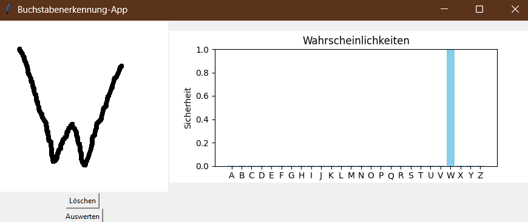

# Installation

Um alle benutzten Libraries zu installieren folgenden Command ausführen:

```bash
pip install tensorflow scikit-learn opencv-python Pillow matplotlib
```

# Verwendung

Um das Python-Skript `gui.py` auszuführen, öffne das Terminal und führe den folgenden Befehl aus:

```bash
python gui.py
```

# Aussehen der GUI



# Optional um eigenes Modell zu trainieren

- BigDataSet entpacken(im selben Ordner)
- ausführen von prepare_data.py => es werden 2 numpy Arrays erstellt
- ausführen von create_model => trainiert ein neues Modell mit 100 Epochen anhand von BigDataSet